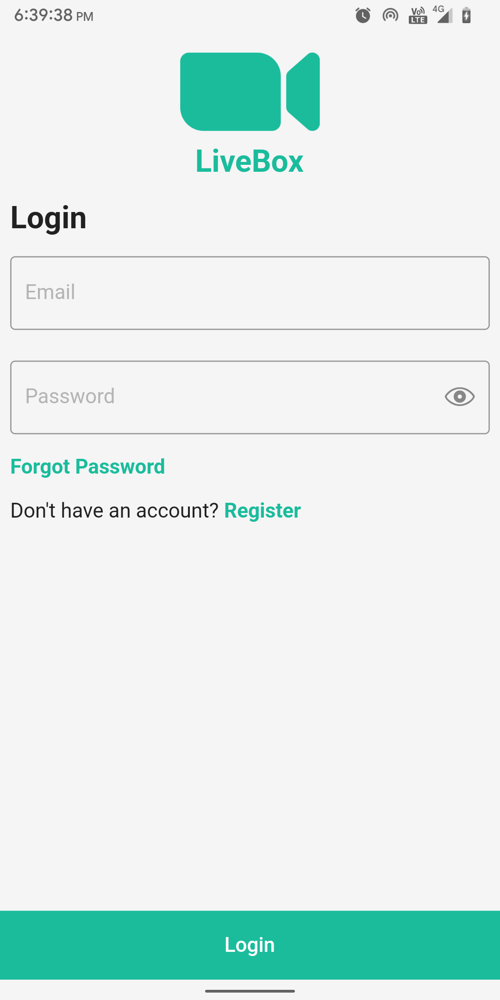
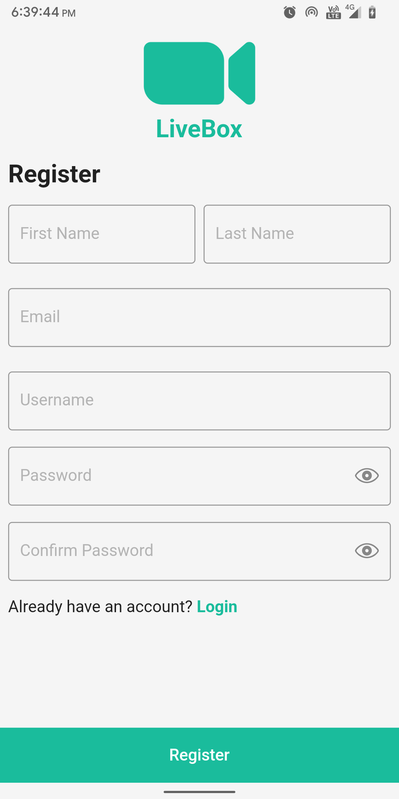
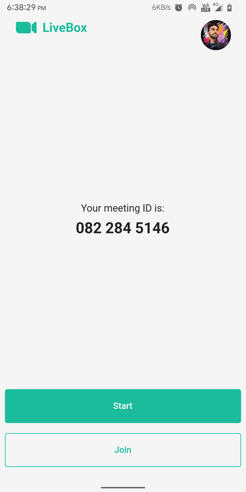
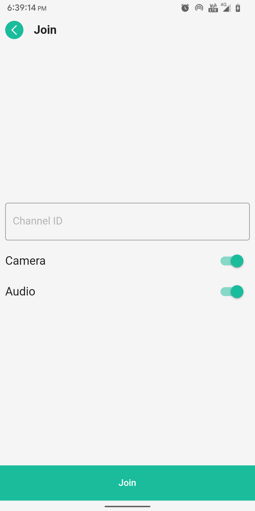

# LiveBox : A Video Calling App

LiveBox is a video calling and conferencing app that allows you to make video calls with your friends and family.

[][releases]

- The app is developed using Flutter and Agora SDK.

- The app is currently in development and is not yet available on Play Store.

- The app is currently available for Android only.

- We are open to contributions. If you want to contribute, please read the [CONTRIBUTING.md](CONTRIBUTING.md) file.

- Feel free to open an issue or a pull request.

## Setup

- Create `secrets.dart` file in constants folder.
- Add the following code to the file.

```dart
abstract class AppSecrets {
    static const appId = "XXX-XXX-XXX-XXX";
    static const certificate = "XXX-XXX-XXX-XXX";
    static const githubToken = 'XXX-XXX-XXX-XXX';
}
```

- Replace XXX-XXX-XXX-XXX with your values in the file.
- Now run the following commands:

```dart
flutter clean
flutter pub get packages
```

## Screenshots

### Login Screen



### Registration Screen



### Home Screen



### Join Meeting Screen



## Download

You can download the app from the [releases page][releases].

## Authors

- **[Nikhil Rajput][portfolio]** - *Owner & Lead Developer*

## Features

- [x] User Authentication
- [x] Change Profile Picture
- [x] Change Username
- [x] Change Password
- [x] Change Name
- [x] Video Calling & Conferencing

## Future Plans

- [ ] Video quality selection and control
- [ ] Video recording
- [ ] Video frame rate control
- [ ] End to end encryption
- [ ] Video switching and screen sharing
- [ ] Face detection and beautification

## License

This project is licensed under the GPL-3.0 License - see the
[LICENSE.md](LICENSE.md) file for details

## Connect With Me

[][website]

[][github]

[][instagram]

[][facebook]

[][twitter]

[][linkedin]


[github]: https://github.com/nixrajput
[website]: https://nixlab.co.in
[facebook]: https://facebook.com/nixrajput07
[portfolio]: https://nixrajput.nixlab.co.in
[twitter]: https://twitter.com/nixrajput07
[instagram]: https://instagram.com/nixrajput
[linkedin]: https://linkedin.com/in/nixrajput
[releases]: https://github.com/nixrajput/video-calling-app-flutter/releases
